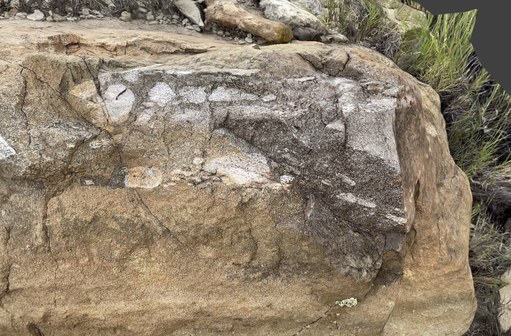

# Ojito Discoveries

### Background

The names of the sites we use were developed primarily based on what I think a basin or mesa resembled looking down from a view as in Google Earth. Locations such as "Jeffersons Nose" - to me - resemble the image of Thomas Jefferson on a nickel. "Mammoth Mesa" resembles the head , tusks and trunk of a wooly mammoth when observed from overhead.  Most of the data and images we have were collected over the span of years form 2014 to 2022 or so.

Several images, video, and 3D scan sites are provided to get a better sense of our discoveries in the Ojito.

Let me share a little of why we love searching for dinosaur bones!  To put it simply - Its the THRILL of DISCOVERY!

**Click the image below to watch 3 minutes of video**

- [Petroglyphs Gallery](https://ojitopetroglyphsadventure.netlify.app/)
- [Quick Survey Gallery](https://foptalkquicksurveyphotos.netlify.app/)
- [Osteo maps](https://favoriteosteomaps.netlify.app/)
- [Burro mesa Claw](https://favoriteburroclaw.netlify.app/)
- [Burro](https://favoriteburro.netlify.app/)
- [Other sites](https://foptalkadditionalimagesqna.netlify.app/)
- [FOP Additional Images](https://fopadditioanlimageszz.netlify.app/)
- [Batwing mesa](https://favoritebat.netlify.app/)
- [Beauty Rocks](https://favoritebmbeautyrocks.netlify.app/)
- [Chi mesa](https://favoritechi.netlify.app/)
- [Dragon's Back](https://favoritedb.netlify.app/)
- [Lambda mesa](https://favoritelambda.netlify.app/)
- [Mammoth mesa](https://favoritemammoth.netlify.app/)
- [McConnell](https://favoritemc.netlify.app/)

### Ojito Petroglyphs

The petroglyphs in the Ojito Wilderness, estimated to be around 1,000 years old, are scattered along the edge of a mesa in its southeast corner and are the most extensive in the area. Discovering them requires effort, as their exact location is not widely shared, adding to the sense of accomplishment upon finding them. Standing on the ledge where they are inscribed, the author reflects on the ancient artist who etched these stories into the rock, imagining the timeless landscape and feeling a poignant connection to a fellow human from a distant past.  We have even found pottery sherds with human fingerprints on them!

**Click the image to open the Petroglyphs gallery!**

**Note** The gallery will display thumbnails but click an image of interest to see full size!

### The McConnell sites (I and II)
Described by [Hilde L. Schwartz and Kim Manley in "Geology and stratigraphy of the Seismosaurus locality, Sandoval County, New
Mexico"](https://geoinfo.nmt.edu/publications/periodicals/nmg/14/n2/nmg_v14_n2_p25.pdf).  

#### McConnell I (MCI)
*"MCI consists of an accumulation of disarticulated skeletal elements, including ribs, teeth, vertebrae, one tooth, and one gastrolith in situ. The bones represent at least two individuals, a sauropod and a carnosaur Gillette, 1991). They are at the base of a short, steep slope in a silty olive claystone that crops out 2.8 km southeast of SSI. The MCI stratum is part of a thick floodplain overbank sequence that is near the top of the Brushy Basin Member."*

In our adventures we have found more and larger finds in MCII but MCI does have an apparent "end of an Allosaurus fibula" - or did - we tried to place it out of harms way (floods) protected by a larger boulder - but the last three trips have proven we can no longer find this bone, it very well was likely washed down the arroyo - we still have pictures and video!

#### McConnell II (MCII)
*"Only 0.1 km south-southeast of MCI, the MCII site is stratigraphically 13 m higher than its neighbor. One large bone and numerous bone flakes and fragments (unidentified to date) are exposed here. They are eroding from a dark reddish-brown siltstone bed that is part of the same floodplain-overbank complex as MCI."*

MCII sports a couple of large splintering bones eroding out from red claystone. The larger appears to be a large head of rib of a sauropod of some kind.

This was Sam's first dino find!  Man were we all excited!

See the video adventure below:

**Click the image below to watch 3 minutes of video**

**Click the image below to enter the McConnell Gallery**

# Burro mesa

I dubbed Burro mesa due to its shape when viewed from Google Earth. There are several sites located on or near the mesa.  The first is the allosaurus site on Burro mea proper. Then there is a satellite mesa to the east about 20 to 30 yards that also has predominantly allosaurus fossils

several hundred yards north of this mesa proper we found a large sauropod limb in situ and eroding out of a thin sandstone lens

### Burro mesa - Large sauropod femur by tree

**Click the image below to manipulate the bone in 3D**

Ben took a picture earlier in the day, from a few hundred yard away of this lonesome looking old gnarly juniper tree.  Later in the day, when we were passing close by, Ben starting finding grapfruit size pieces of bone, and when we followed it to its source - we discovered this partial sauropod femur. You can see the lonely tree in this video - its roots helping to hold the femur in place!

Here's a video showing the discovery!

**Click the image below to manipulate the bone in 3D**

### Burro mesa - Allosaurus Carpal
**Click the image below to manipulate the bone in 3D**

From Burro mesa area - quite a few Allosaurus bits!

Rotate the boulder with a a mouse and zoom in or out with a scroll wheel, or translate with a SHIFT Mouse until you can clearly view the darker gray carpal bone of an allosaur!

### Burro mesa Fibula end and Frags

**Click the image below to manipulate the bone in 3D**

Rotate the boulder down 90 degrees with a a mouse and zoom in or out with a scroll wheel, or translate with a SHIFT mouse until you can clearly view the partially exposed claw of an allosaur! Now in the New Mexico Museum of Natural History Annex!

Most probably an Allosaurus fibula proximal end.

### Burro mesa - Allosaurus Claw!

Here we are with our Allosaurus claw find

**Click the image below to watch 1.5 minutes of video**

To manipulate the 3D scan play with it in scaniverse:

**Click the image below to manipulate the bone in 3D**

Rotate the image about 30 degrees downward to see the Fibula tip and other frags we placed on top of the boulder

After fiddling with the GoPro, we were able to record a video of us pondering what this fossil is. It did not dawn on me until the drive out that this is an Allosaurus Claw.

**Click the image below to watch 37 seconds of video**

Ben and I had a great time exploring this side of Sigma and down into what we later dubbed Burro mesa. Here I traverse that flat squishy claystone arroyo strewn with black rocks to investigate a hoodoo that was offering cover for a land-slid in situ embedded Allosaurus claw!

In this video we ponder what this fossil is.

**Click the image below to watch 3 minutes of video**

### Burros mesa - Closer view of same Claw

This was a different 3D scan of the same claw

Watch a video that shows better 3D detail of the claw with my fingers for scale.

**Click the image below to watch 1 minute of video**

### Burro mesa - Possible in situ tooth (white)

**Click the image below to manipulate the bone in 3D**

Burro mesa - here is a possible tooth in situ. Zoom in, and translate the image downward - look for white bone or tooth near top of boulder. 

Across from Burro mesa maybe 20 yards on the western slope of a short cliffy, rocky slope. A white clast that is fossiliferous, but not boney. We think it may be a tooth - possibly allosaurus.

### Burro mesa - Allosaurus Scapula

**Click the image below to manipulate the bone in 3D**

This is located perhaps 20 yards from the other Burro bits

### Burro mesa - Allosaurus limb femur

**Click the image below to manipulate the bone in 3D**

The first bone we found at what we later called Burro mesa. This was the first time we encountered the mix of agatized outer bone with a solid calcite inner core of what was in life a hollow femur of a large therapod. Large diameter allosaurus femur, maybe 8 inches width, split showing the calcium filled core of bone. This shows agatized white outer bone, and a softer calcium carbonate inner core.

### Burro mesa - Allosaurus Partial Skull?

**Click the image below to manipulate the bone in 3D**

Here is a video of us looking over this land-slid fossil before it eventually broke along one of the cracks.

**Click the image below to watch 16 seconds of video**

### Burro mesa - Limb Excav

**Click the image below to manipulate the bone in 3D**

We showed a designated NMMNH museum collector who has BLM permission to collect where our allosaurus find was, and we got to help him excavate this limb from the boulder and deposit in the Museum Annex.

### Burro mesa - Limb excavated hole shows relief or cast of the limb

**Click the image below to manipulate the bone in 3D**

Here is the same boulder with the remaining "cast" after the bone was pried out
Burro_AllosaurFibula.png. The museum collected this specimen and it is ni the Annex.

### Burro mesa - Rib in Saltwash

**Click the image below to manipulate the bone in 3D**

# Cary - Allosaurus neck rib and vertebrae

**Click the image below to manipulate the bone in 3D**

The first bone we ALMOST found and much later stumbled upon for the win. Early in 2014 Ben, Sam and I explored the area referred to as Cary (from the whitepaper noted above). Both boys asked me how to tell if they were looking at bone and I told them to "scrutinize anything different". Ben stood right next to a small juniper tree drinking water that day - and missed these bones right at his feet. Several years later Ben and I re-scanned the area and made this discovery!

# Chi Mesa

### Chi mesa - Allosaurus Radius

**Click the image below to manipulate the bone in 3D**

Ben, Pam, Abbey, Liam, Ben, Sam and I hiked in towards Chi Mesa and starting finding new bones. Sam found a cliffy area with lots of Allosaur bits near our Chi mesa Allosaur tibia. Ben found a beautiful red rib and I found this nice Allosaur radius or ulna.

### Chi mesa - Diplodocus femur head

**Click the image below to manipulate the bone in 3D**

See the video adventure below:

**Click the image below to watch 3 minutes of video**

### Chi Mesa - Camarasaurus tooth

**Click the image below to manipulate the bone in 3D**

Nice spring day in April 20121. April 03, we did another rescan of Chi mesa area prior to leading the FOP group our here a week later. As we climbed up the western slope looking easterly at our feet on the steep slope, Sam said he found something bone like but he was not sure what it was. Then he found more and more. In all he found about 5 fragments of what Ben first realized was a tooth!  I recognized the spoon like nature of the tooth and thought it may be a camarasaurus (common in Brushy Basin) or Brachiosaurus (rare world wide).

See the video adventure below:

**Click the image below to watch 3 minutes of video**

# Crescent Mesa

### Crescent Mesa Stegosaurus Spike collected for NMMNH

**Click the image below to manipulate the bone in 3D**

2017/03/18 Beautiful March day!. We explore Crescent mesa along with sites in the Baltic sea area so named by me. Today it is Sam, Ben, me (Dad) discovering our first Stegosaurus spike in float. There are other bones in land-slid in situ boulder above but those bones are indeterminant by us!

See the video adventure below:

**Click the image below to watch 3 minutes of video**

### Crescent Mesa Stegosaurus In Situ

Crescent mesa looked unimpressive at first, from Google Earth. It seemed narrow and very monotone gray.  We had been used to finding bones in clays that wre multicolored. Once we discovered the significance of long gar like mesa shapes like Mammoth mesa, which were also monotone from the air, we developed an affinity for finding bones in these long narrow mesa and associated land-slid boulders. Once we adjusted to the new possibilities,  we began the exploration of mesa such as Crescent and Batwing, and were not disappointed. Crescent mesa has bits of larger orange bone frags on the western side, and the stegosaurus spike and other bits on the east side.

**Click the image below to manipulate the bone in 3D**

# Dragon's Back Bones

We searched Dragon's Back on Dec 27, 2014. Our first non Ojito Wilderness exploration, but still in the area we refer to colloquially as the Ojito.  I had found a geological map that students from France had created after their survey years earlier. They included a shot of a dinosaur bone in a cliff somewhere along their traverse. We decided to explore the area. We started our hike on a cold and windy day. I decided we could take shelter along the western cliff face of the anticline area of San Ysidro ( Eastern most part of the bowl). This reduced the wind significantly but also within a couple hundred yards we began to find bone and LARGE in situ bones in the cliff. Bones including a nice leg bone and cast, and a very large diplodocus vertebrae. What an amazing day!

[DB Limb on trail](https://scaniverse.com/scan/2nrsu5l54d5d7bai)

[DB Diplodocus vertebrae](https://scaniverse.com/scan/bbvitgtbt2wcytya)

# Germany

We discovered and dubbed Germany on Spring break during 2015 in mid March. Ben & Sam and I camped on a mesa top and spent two days exploring basins (that I dub seas, such as Baltic sea, Mediterranean sea, etc) and mesas that tend to look like coast lines of countries like Italy, or Greece and then we devolved into naming high places or mesas by other country names in Europe. Germany is not far from Italy and was next on our list of names when we found bones at the site.

[Germany in situ claystone w small diagnostic piece](https://scaniverse.com/scan/fjr2besm2t3qrdyn)

# Batwing mesa

Batwing mesa
is maybe on the order of Dragons back, Burro mesa and even Mammoth mesa for numbers of in situ land-slid and cliff embedded bone frags. Most of these are indeterminant bone frags but they are very interesting. It should be at least exlored for a half to one day - two days to take in most of the bones. The name Batwing comes from the appearance fo the parentheses shapes mesas in the northern Ojito. They look like a kind of Bat signal hence the name.  Batwing, for us, refers to the Western most wing.

[Batwing Sam's Boulder limb](https://scaniverse.com/scan/h6jcie627f4a6q4e)

# Lambda Fat mesa

Lambda fat is near Mammoth mesa and Y mesa and has a nice assemblage of camarasaurus vertebrae, a tiny goniopholid tooth and other bits. Nice color on the camarasaurus vertebrae - white bone in red sandstone matrix. This can be rescanned in a couple of hours.

[Lambda Fat original vert find in situ](https://scaniverse.com/scan/5eiei327ftl2onsy)

[Lambda Fat three verts collected gray nice](https://scaniverse.com/scan/eq4ajky7cciszoq2)

[Lambda Fat Camarasaurus vert 2](https://scaniverse.com/scan/pmbmpzngsjfiv6md)

# Mammoth mesa

I dubbed Mammoth mesa based on the shape of interconnecting mesa and knob which taken together resemble the profile of a mammoth head, tusk, and trunk.  We have discovered HUNDREDS of bone fragments in situ in the cliff or in land-slid boulders here. Multiple species but most likely allosaurus and diplodocus bits but likely others as well.

Large sauropod rib heads, rib of allosaurus most likely, a probable therapod spine in situ in a large boulder, multiple sauropod limbs, saoropod and likely allosaurus vertebrae.

[MM Mesa large limb boulder](https://scaniverse.com/scan/qpgtfdvnkpwv6abp)

[MM Cliff Face Sheared Scapula](https://scaniverse.com/scan/wbpfzrumyirrnajw)

[MM Mesa large limb boulder](https://scaniverse.com/scan/qpgtfdvnkpwv6abp)

[MM Mesa allosaurus rib](https://scaniverse.com/scan/b4gsjsqgbwo6saqk)

[MM Mesa vertebrae chain](https://scaniverse.com/scan/p7fg2o37w4uhkdp6)

[MM Mesa nice limb](https://scaniverse.com/scan/ijhgbjbi5pf5t5ay)

[MM Nice Rib Head](https://scaniverse.com/scan/ftoqie63khfgb7wt)

[Ravens Head Rib w Concretion look for white rib under brown concretion](https://scaniverse.com/scan/4vaek5atrbcdq5c4)

# Ravens Head

I Dubbed Raven's head based on the shape of the mesa as it appears from Google Earth. After I dubbed it, Ben and I decided to explore it. What a great adventure. Raven's head has a handful of very cool finds but we have not been able to extend them much lately.

[Raven head route great pottery bowl red w black](https://scaniverse.com/scan/wjzveausvlfvlpuq)

[Raven Gray pottery Raven head route](https://scaniverse.com/scan/6zcwiofz5gf4fyzd)

[Raven head stegosaurus humerus](https://scaniverse.com/scan/jlk6pm6glj5lyt4s)

[Raven stegosaurus humerus](https://scaniverse.com/scan/chaupq7m7r67cpc6)

# Rattlesnake mesa

I dubbed Rattlesnake mesa based on a vigorus Diamond Back rattle snake encounter we had in March of 2015. Sam heard it rattling somewhere aboout 50 to 75 yards away!  We got excellent photos of it before it took cover under a large boulder. The encounter slowed our progress throughout the day as we climbed up and over and around boulder after boulder.

Right about the time Sam detected the snake we were finding lots of bone fragments on the southern and western faces of the mesa.  After the encounter we also discovered a very nice red split sauropod vertebrae in float - the size of a bowling ball!

[RTL nc2 rib minor](https://scaniverse.com/scan/sfiajq7dj5cbrpvm)

[RTL nc2 rib 2 major](https://scaniverse.com/scan/psfr46uxyv62bpgy)

[RTL WOW red vert context](https://scaniverse.com/scan/dkxw5fp3igbaoreg)

[RTL WOW RED VERTEBRA](https://scaniverse.com/scan/z77wp6mkjno4vkqs)

# Y Mesa

Y mesa is across Bernalillito arroyo adn is deep and dangerous to cross in the summer due to flash floods from Monsoon rain season. We have to take care to get our summer excursion out and across that arroyo and exploration done BEFORE about noon and the threat of afternoon rains!

During such an excursion in July 2015, Ben and I discovered an amazing number and variety of bones. As we pressed on again 12 noon and to about 1PM we were hurrying to get back across the arroyo. We took a shortcut up and over Y Mesa to get back quickly to cross the Arroyo and in so doing discovered a nice Allosaurus Pelvis in situ in the sandstone!

[Y Mesa Green Plate](https://scaniverse.com/scan/r3mzsaciiduokeli)

[Y Mesa Fibula end near green plate](https://scaniverse.com/scan/vz4jegdkzlf4zq5w)

[Y Mesa Allosaurus pelvis](https://scaniverse.com/scan/6zxscpaaypqymcxc)

