# Ojito Discoveries

## Background

The names of the sites we use were developed primarily based on what I think a basin or mesa resembled looking down from a view as in Google Earth. Locations such as "Jeffersons Nose" - to me - resemble the image of Thomas Jefferson on a nickle. "Mammoth Mesa" resembles the head , tusks and trunk of a wooly mammoth when observed from overhead.  Most of the data and images we collected were collected over the span of years form 2014 to 2022 or so.

Several images, video, and 3D scan sites are provided to get a better sense of our discoveries in the Ojito.

Let me share a little of why we love searching for dinosaur bones!  To put it simply - Its the THRILL of DISCOVERY!

**Click the image below to watch 3 minutes of video**

## Ojito Petroglyphs

The petroglyphs in the Ojito Wilderness, estimated to be around 1,000 years old, are scattered along the edge of a mesa in its southeast corner and are the most extensive in the area. Discovering them requires effort, as their exact location is not widely shared, adding to the sense of accomplishment upon finding them. Standing on the ledge where they are inscribed, the author reflects on the ancient artist who etched these stories into the rock, imagining the timeless landscape and feeling a poignant connection to a fellow human from a distant past.  We have even found pottery sherds with juman fingerprints on them!

**Click the image to open the Petroglyphs gallery!**

<a href="https://ojitopetroglyphsadventure.netlify.app/">
    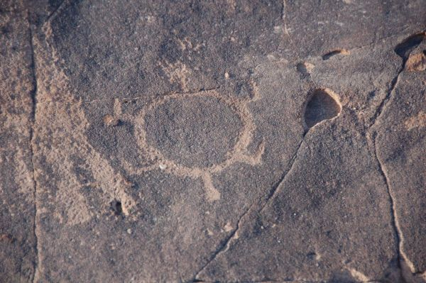
</a>

**Note** The gallery will display thumbnails but click an image of interest to see full size!

## The McConnell sites (I and II)
Described by [Hilde L. Schwartz and Kim Manley in "Geology and stratigraphy of the Seismosaurus locality, Sandoval County, New
Mexico"](https://geoinfo.nmt.edu/publications/periodicals/nmg/14/n2/nmg_v14_n2_p25.pdf).  

#### McConnell I (MCI)
*"MCI consists of an accumulation of disarticulated skeletal elements, including ribs, teeth, vertebrae, one tooth, and one gastrolith in situ. The bones represent at least two individuals, a sauropod and a carnosaur Gillette, 1991). They are at the base of a short, steep slope in a silty olive claystone that crops out 2.8 km southeast of SSI. The MCI stratum is part of a thick floodplain overbank sequence that is near the top of the Brushy Basin Member."*

In our adventures we have found more and larger finds in MCII but MCI does have an apparent "end of an Allosaurid fibula" - or did - we tried to place it out of harms way (floods) protected by a larger boulder - but the last three trips have proven we can no longer find this bone, it very well was likely washed down the arroyo - we still have pictures and video!

#### McConnell II (MCII)
*"Only 0.1 km south-southeast of MCI, the MCII site is stratigraphically 13 m higher than its neighbor. One large bone and numerous bone flakes and fragments (unidentified to date) are exposed here. They are eroding from a dark reddish-brown siltstone_bed that is part of the same floodplain-overbank complex as MCI."*

MCII sports a couple of large splintering bones eroding out from red claystone. The larger appears to be a large head of rib of a sauropod of some kind.

This was Sam's first dino find!  Man were we all excited!

See the video adventure below:

**Click the image below to watch 3 minutes of video**

**Click the image below to enter the McConnell Gallery**
<a href="https://favoritemc.netlify.app/">
    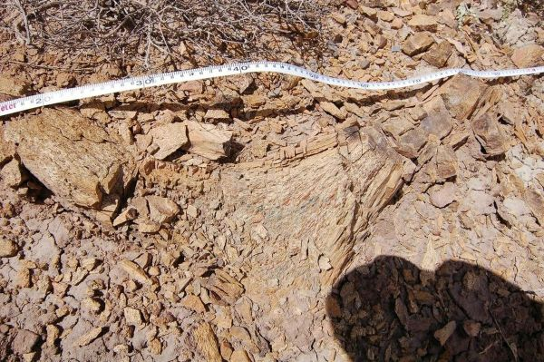
</a>

# scaniverse (3D)

## Burro mesa - Large sauropod femur by tree

**Click the image below to manipulate the bone in 3D**
<a href="https://scaniverse.com/scan/n45y43l2ffq7cvcy">
    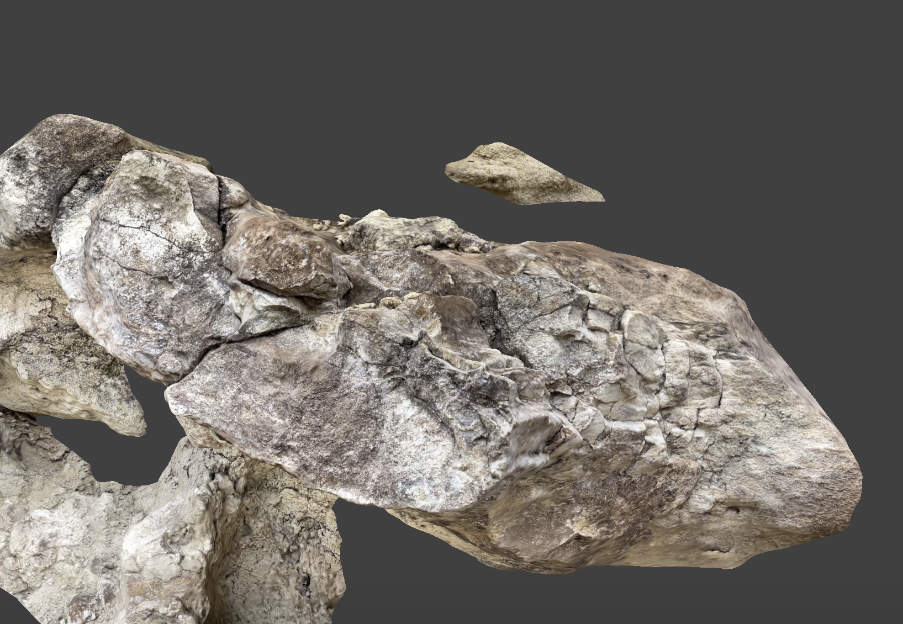
</a>

Ben took a picture earlier in the day, from a few hundred yard away of this lonesome looking old gnarly juniper tree.  Later in the day, when we were passing close by, Ben starting finding grapfruit size pieces of bone, and when we followed it to its source - we discovered this partial sauropod femur. You can see the lonely tree in this video - its roots helping to hold the femur in place!

Here's a video showing the discovery!

**Click the image below to manipulate the bone in 3D**
<a href="https://youtu.be/KLSJt6LzkR8">
    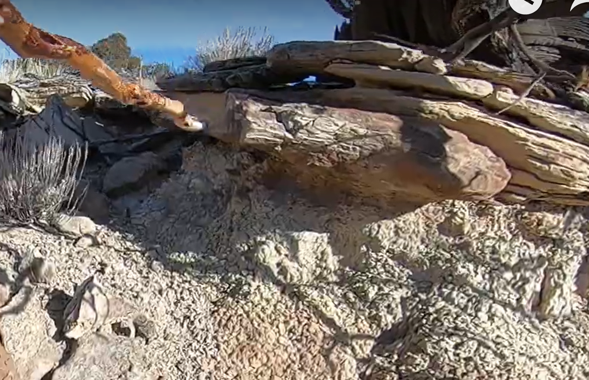
</a>

### Burro mesa - Allosaurus Carpal
**Click the image below to manipulate the bone in 3D**
<a href="https://scaniverse.com/scan/4zpqghjstlkfivuh">
    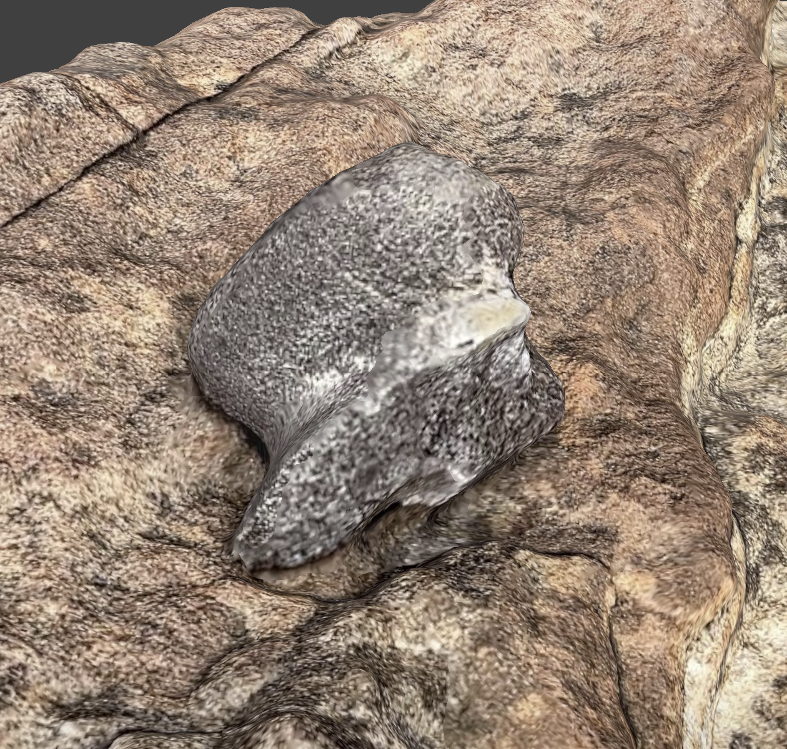
</a>

From Burro mesa area - quite a few Allosaurus bits!

Rotate the boulder with a a mouse and zoom in or out with a scroll wheel, or translate with a SHIFT Mouse until you can clearly view the darker gray carpal bone of an allosaur!

### Burro mesa Fibula end and Frags

**Click the image below to manipulate the bone in 3D**

Rotate the boulder down 90 degrees with a a mouse and zoom in or out with a scroll wheel, or translate with a SHIFT Mouse until you can clearly view the partially exposed claw of an allosaur! Now in the New Mexico Museum of Natural Hostory Annex!

Most probably an Allosaurus fibula proximal end.

### Burro mesa - Allosaurus Claw!

**Click the image below to manipulate the bone in 3D**

Rotate the iage about 30 degrees downward to see the FIbula tip and other frags we placed on top of the boulder

### Burros mesa - Closer view of same Claw

## Burro mesa - Possible in situ tooth (white)

**Click the image below to manipulate the bone in 3D**
<a href="https://scaniverse.com/scan/zo535nacuqgaqwoz">
    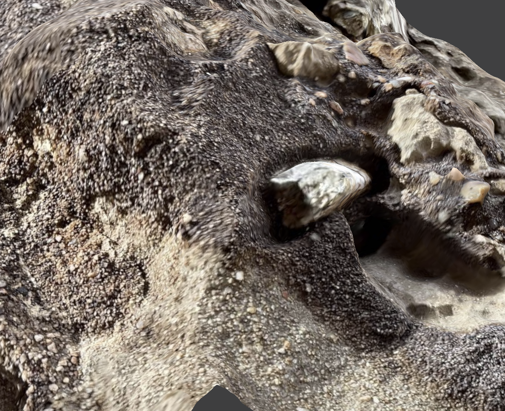
</a>

Burro mesa - here is a possible tooth in situ. Zoom in, and translate the image downward - look for white bone or tooth near top of boulder. 

Across from Burro mesa maybe 20 yards on the western slope of a short cliffy, rocky slope. A white clast that is fossiliferous, but not boney. We think it may be a tooth - possibly allosaurus.

## Burro mesa - Allosaurus Scapula

**Click the image below to manipulate the bone in 3D**

This is located perhaps 20 yards from the other Burro bits

## Burro mesa - Allosaurus limb femur

**Click the image below to manipulate the bone in 3D**
<a href="https://scaniverse.com/scan/6srgruxo2j36vynw">
    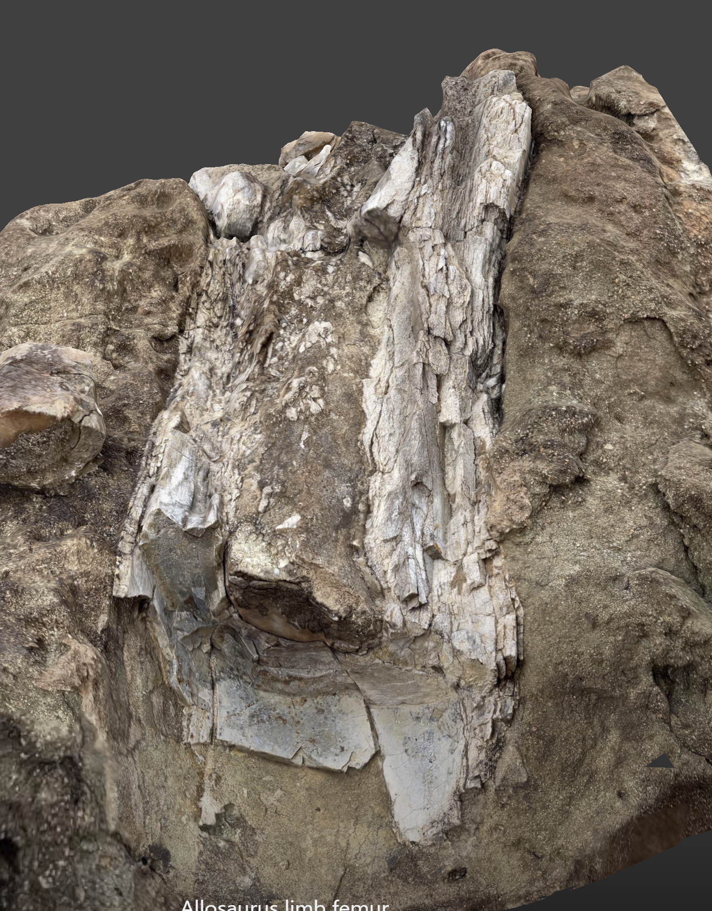
</a>

The first bone we found at what we later called Burro mesa. This was the first time we encountered the mix of agatized outer bone with a soild calcite inner core of what was in life a hollow femur of a large thropod. Large diameter allosaurus femur, maybe 8 inches width, split showing the calcium filled core of bone. This shows agatized white outer bone, and a softer calcium carbonate inner core.

## Burro mesa - Allosaurus Partial Skull?

**Click the image below to manipulate the bone in 3D**

## Burro mesa - Limb Excav

**Click the image below to manipulate the bone in 3D**

We showed a designated NMMNH museum collector who has BLM permission to colelct where our allosaurus find was, and we got to help him excavate this limb from the boulder and deposit in the Museum Annex.

## Burro mesa - Limb excavated hole shows relief or cast of the limb

**Click the image below to manipulate the bone in 3D**
<a href="https://scaniverse.com/scan/6ethygaukelxwict">
    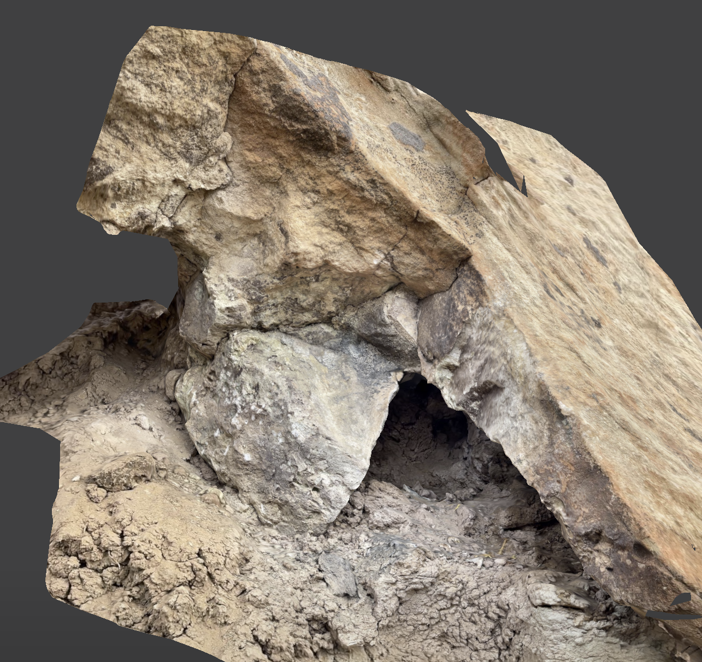
</a>

Here is the same boulder with the remaining "cast" after the bone was pried out
Burro_AllosaurFibula.png. The musem collected this speciment and it is ni the Annex.

## Burro mesa - Rib in Saltwash

**Click the image below to manipulate the bone in 3D**

## Cary - Allosaurus neck rib and vertebrae

**Click the image below to manipulate the bone in 3D**

The first bone we ALMOST found and much later stumbled upon for the win. Early in 2014 Ben, Sam and I explored the area referred to as Cary (from the whitepaper noted above). Both boys asked me how to tell if they were looking at bone and I told them to "scrutinize anything different". Ben stood right next to a small juniper tree drinking water that day - and missed these bones right at his feet. Several years later Ben and I re-scanned the area and made this discovery!

## Chi mesa - Allosaurus Radius

**Click the image below to manipulate the bone in 3D**
<a href="https://scaniverse.com/scan/6b4bxam554dp7cdo">
    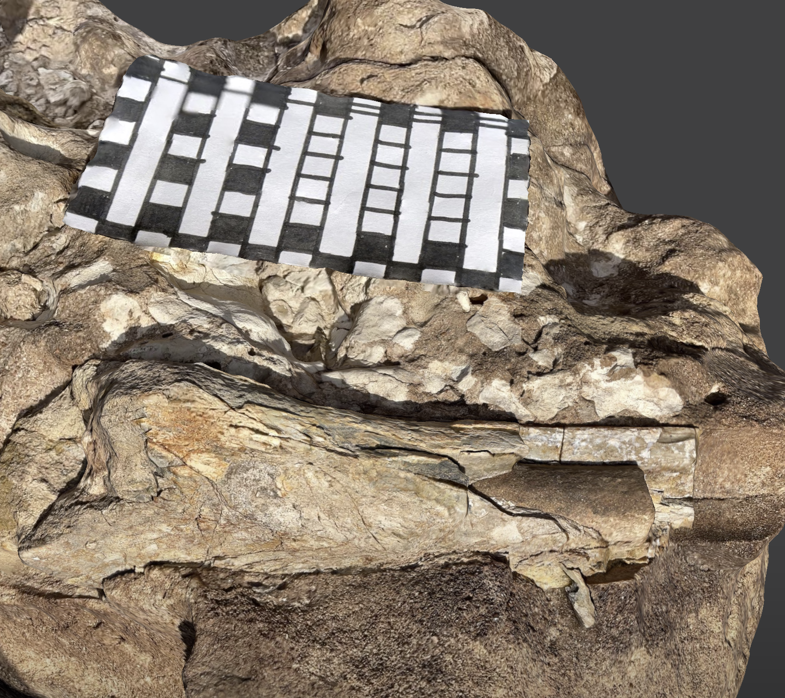
</a>

Ben, Pam, Abbey, Liam, Ben, Sam and I hiked in towards Chi Mesa and starting finding new bones. Sam found a cliffy area with lots of Allosaur bits near our Chi mesa Allosaur tibia. Ben found a beautiful red rib and I found this nice Allosaur radius or ulna.

## Chi mesa - Diplodocus femur head

**Click the image below to manipulate the bone in 3D**
<a href="https://scaniverse.com/scan/yf4qybj36pyuw4k6">
    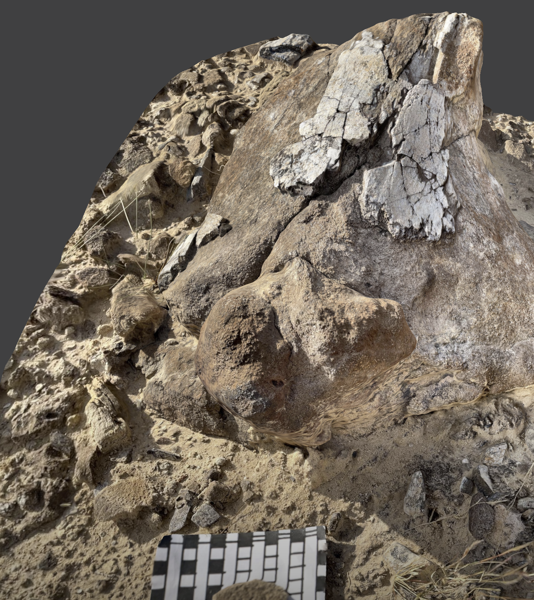
</a>

See the video adventure below:

**Click the image below to watch 3 minutes of video**

## Chi Mesa - Camarasaurus tooth

**Click the image below to manipulate the bone in 3D**
<a href="https://scaniverse.com/scan/2s2pqrczaa4t5adz">
    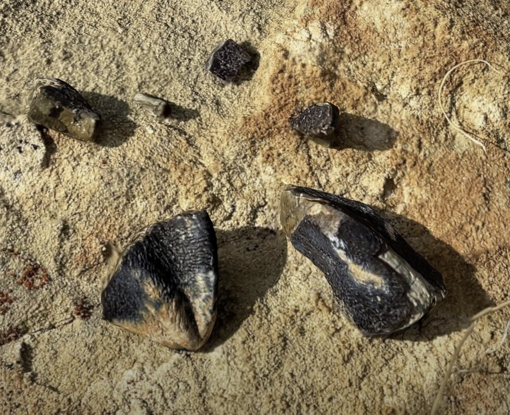
</a>

Nice spring day in April 20121. April 03, we did another rescan of Chi mesa area prior to leading the FOP group our here a week later. As we climbed up the western slope looking easterly at our feet on the steep slope, Sam said he found something bone like but he was not sure what it was. Then he found more and more. In all he found about 5 fragments of what Ben first realized was a tooth!  I recognized the spoon like nature of the tooth and thought it may be a camarasaurus (common in Brushy Basin) or Brachiosaurus (rare world wide).

See the video adventure below:

**Click the image below to watch 3 minutes of video**
<a href="https://youtube.com/shorts/VyJOVxJtmKQ?feature=share"> 
    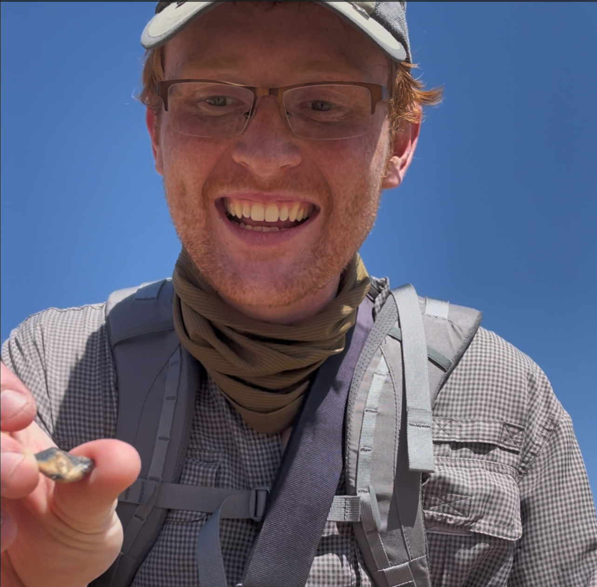
</a>

## Crescent Mesa Stegosaurus Spike collected for NMMNH

**Click the image below to manipulate the bone in 3D**
<a href="https://scaniverse.com/scan/ezvfhqbgaez4vxzr">
    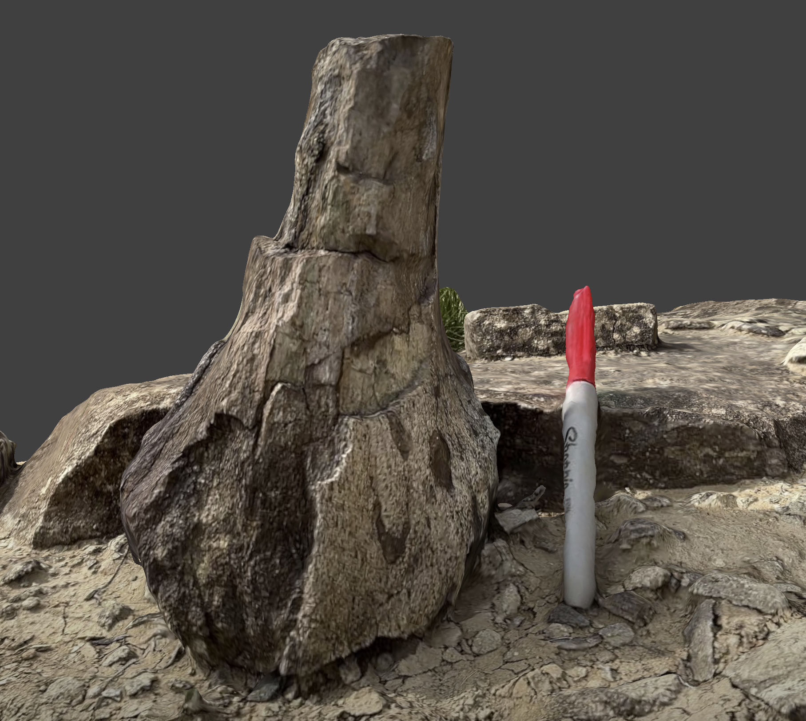
</a>

2017/03/18 Beautiful March day!. We explore Crescent mesa along with sites in the Baltic sea area so named by me. Today it is Sam, Ben, me (Dad) dicovering our first Stegosaurus spike in float. There are other bones in landslid in situ boulder above but those bones are indeterminanet by us!

See the video adventure below:

**Click the image below to watch 3 minutes of video**

[Crescent Mesa Stegosaurus in situ site](https://scaniverse.com/scan/jlhoaxeq7jjsrjhq)

[DB Limb on trail](https://scaniverse.com/scan/2nrsu5l54d5d7bai)

[DB Diplodocus vertebrae](https://scaniverse.com/scan/bbvitgtbt2wcytya)

[Germany in situ claystone w small diagnostic piece](https://scaniverse.com/scan/fjr2besm2t3qrdyn)

[Batwing Sam's Boulder limb](https://scaniverse.com/scan/h6jcie627f4a6q4e)

[Lambda Fat original vert find in situ](https://scaniverse.com/scan/5eiei327ftl2onsy)

[Lambda Fat three verts collected gray nice](https://scaniverse.com/scan/eq4ajky7cciszoq2)

[Lambda Fat Camarasaurus vert 2](https://scaniverse.com/scan/pmbmpzngsjfiv6md)

[MM Mesa large limb boulder](https://scaniverse.com/scan/qpgtfdvnkpwv6abp)

[MM Cliff Face Sheared Scapula](https://scaniverse.com/scan/wbpfzrumyirrnajw)

[MM Mesa large limb boulder](https://scaniverse.com/scan/qpgtfdvnkpwv6abp)

[MM Mesa allosaurus rib](https://scaniverse.com/scan/b4gsjsqgbwo6saqk)

[MM Mesa vertebrae chain](https://scaniverse.com/scan/p7fg2o37w4uhkdp6)

[MM Mesa nice limb](https://scaniverse.com/scan/ijhgbjbi5pf5t5ay)

[MM Nice Rib Head](https://scaniverse.com/scan/ftoqie63khfgb7wt)

[Ravens Head Rib w Concretion look for white rib under brown concretion](https://scaniverse.com/scan/4vaek5atrbcdq5c4)

[Raven head route great pottery bowl red w black](https://scaniverse.com/scan/wjzveausvlfvlpuq)

[Raven Gray pottery Raven head route](https://scaniverse.com/scan/6zcwiofz5gf4fyzd)

[Raven head stegosaurus humerus](https://scaniverse.com/scan/jlk6pm6glj5lyt4s)

[Raven stegosaurus humerus](https://scaniverse.com/scan/chaupq7m7r67cpc6)

[RTL nc2 rib minor](https://scaniverse.com/scan/sfiajq7dj5cbrpvm)

[RTL nc2 rib 2 major](https://scaniverse.com/scan/psfr46uxyv62bpgy)

[RTL WOW red vert context](https://scaniverse.com/scan/dkxw5fp3igbaoreg)

[RTL WOW RED VERTEBRA](https://scaniverse.com/scan/z77wp6mkjno4vkqs)

[Y Mesa Green Plate](https://scaniverse.com/scan/r3mzsaciiduokeli)

[Y Mesa Fibula end near green plate](https://scaniverse.com/scan/vz4jegdkzlf4zq5w)

[Y Mesa Allosaurus pelvis](https://scaniverse.com/scan/6zxscpaaypqymcxc)

